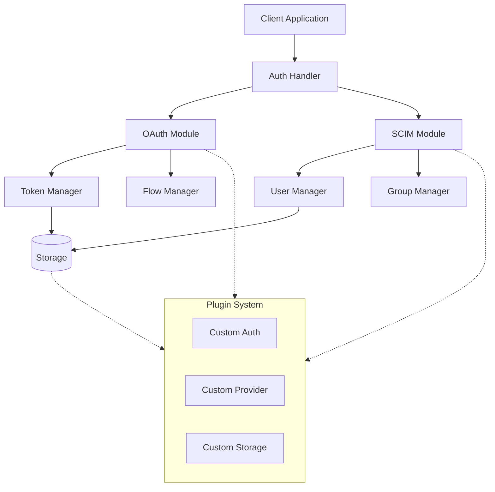
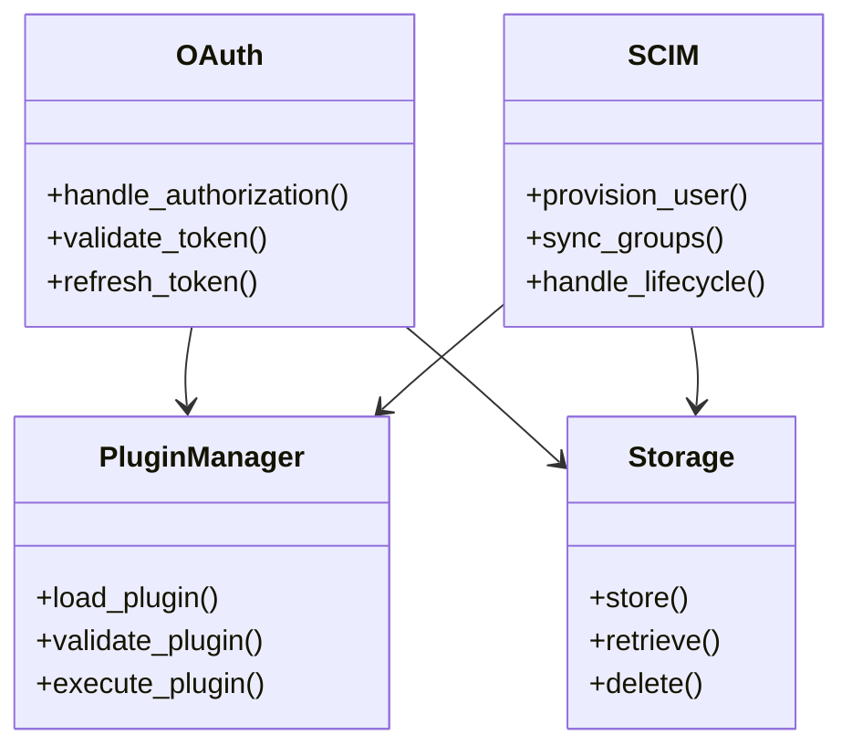
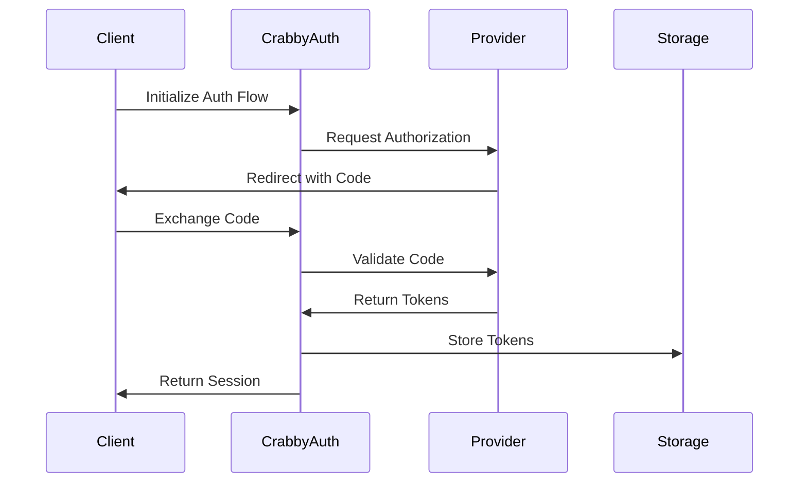
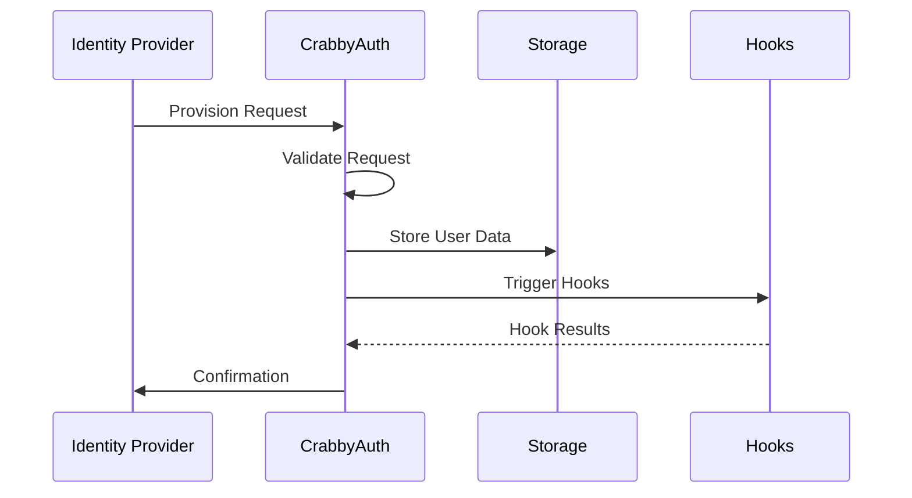
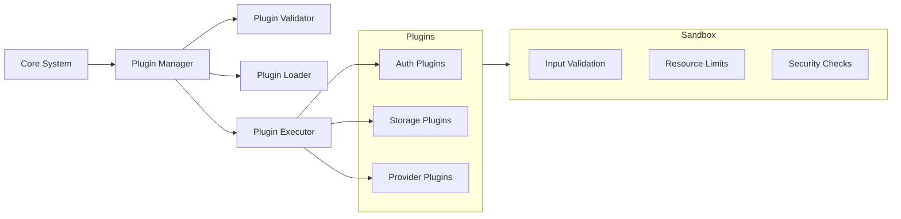
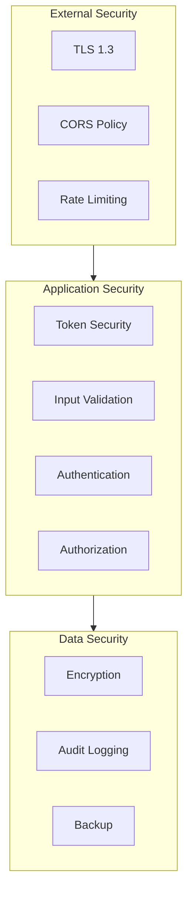
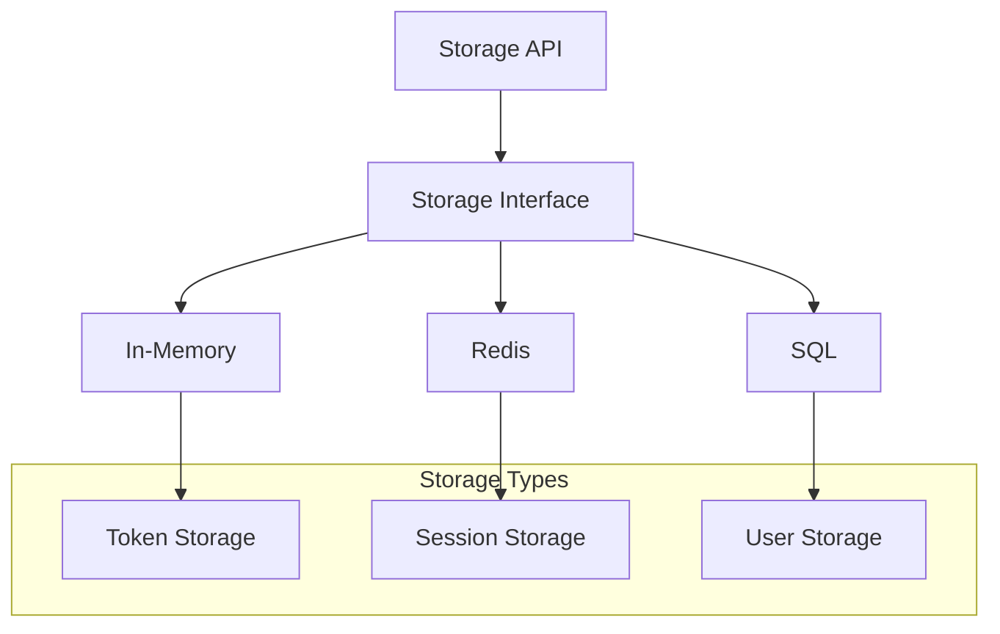
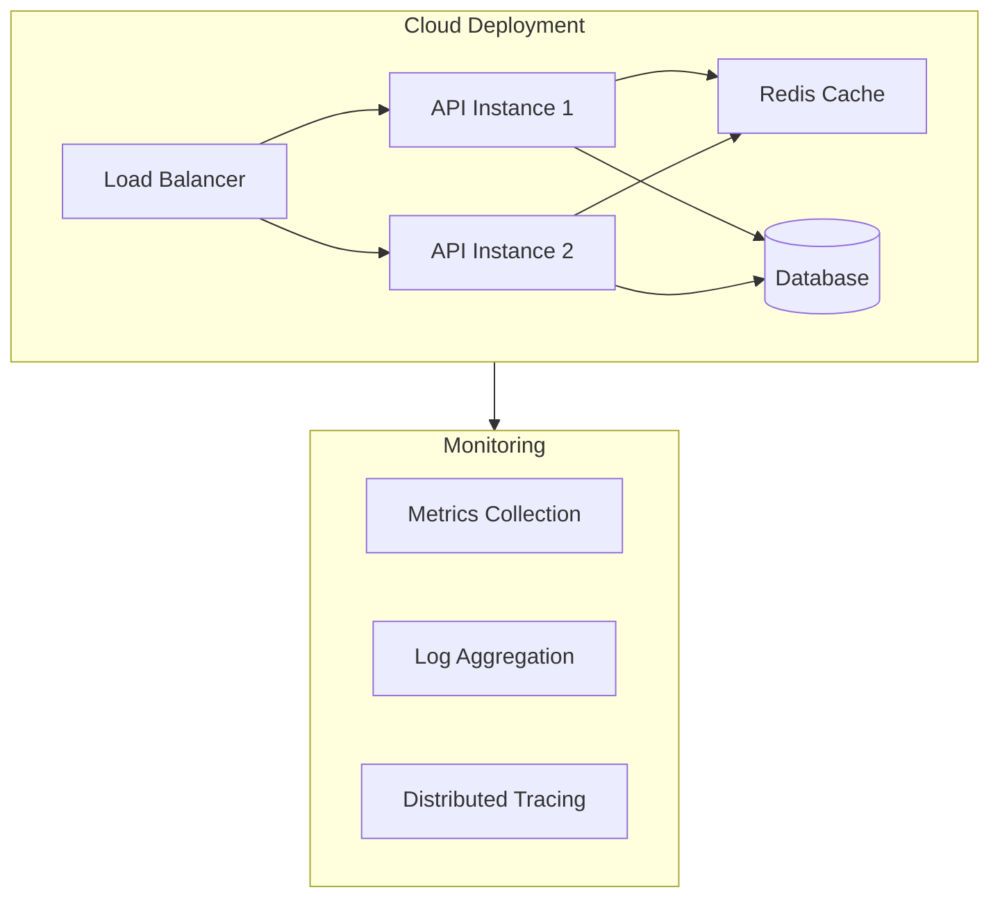

🦀 CrabbyAuth Architecture
Table of Contents

Overview
Core Components
Data Flow
Plugin System
Security Architecture
Storage Architecture
Deployment Architecture

Overview
CrabbyAuth is designed with modularity, security, and extensibility as its core principles. The architecture follows the Rust idioms of zero-cost abstractions and compile-time guarantees while providing a flexible plugin system.
High-Level Architecture



## Core Components

### Component Relationships



# Data Flow

## Authentication Flow


## SCIM Provisioning Flow


# Plugin System
## Plugin Architecture



# Security Architecture

## Security Layers



# Storage Architecture

## Storage Implementation


# Deployment Architecture
## Deployment Options



# Implementation Details
Each component in CrabbyAuth is designed with the following principles:

Zero-Cost Abstractions: Using Rust's trait system to provide flexible interfaces without runtime overhead

Type Safety: Leveraging Rust's type system to prevent common security issues at compile time
Async by Default: Built on async/await for scalable performance

Plugin Safety: Sandboxed plugin execution with resource limits and security boundaries

Core Trait Examples

```rust
pub trait AuthenticationFlow {
    async fn authenticate(&self, request: AuthRequest) -> Result<AuthResponse, AuthError>;
    async fn validate(&self, token: Token) -> Result<Claims, ValidationError>;
}

#[async_trait]
pub trait IdentityProvider {
    async fn provision_user(&self, user: User) -> Result<ProvisionedUser, ProvisionError>;
    async fn sync_groups(&self, user_id: UserId) -> Result<Vec<Group>, SyncError>;
}

#[async_trait]
pub trait StorageBackend {
    async fn store<T: Serialize>(&self, key: &str, value: T) -> Result<(), StorageError>;
    async fn retrieve<T: DeserializeOwned>(&self, key: &str) -> Result<T, StorageError>;
}
```

The architecture is designed to be both secure by default and extensible through a carefully controlled plugin system. Each component is isolated and communicates through well-defined interfaces, making the system both maintainable and secure.
For more detailed information about specific components, please refer to their respective documentation sections:

### OAuth Implementation
### SCIM Implementation
### Plugin System
### Security Model